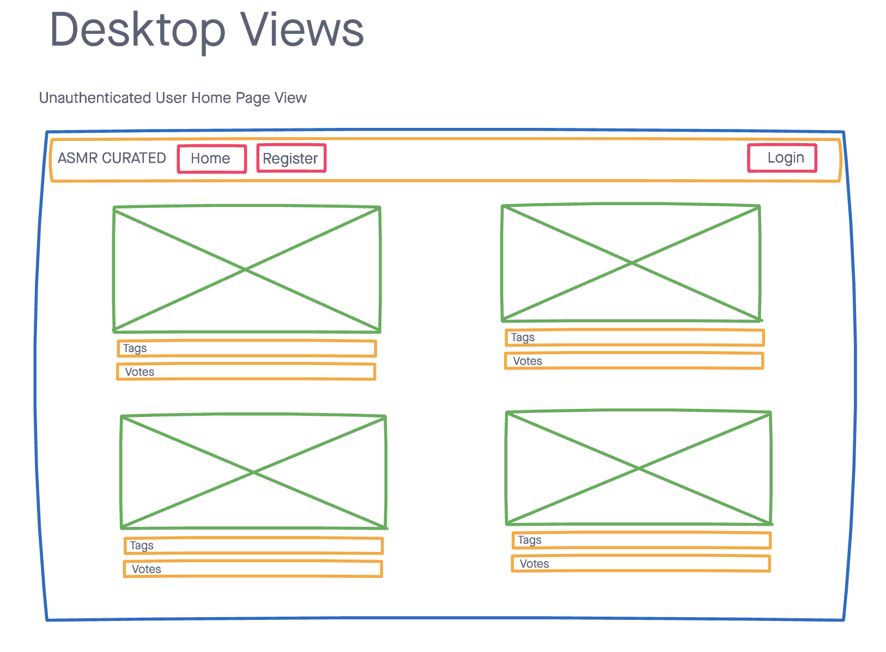
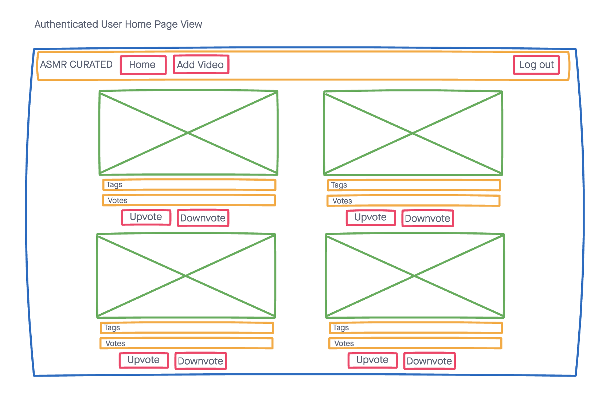

# ASMR CURATED

ASMR Curated is a site for ASMR aficionados to share their favorite ASMR Youtube videos. Users can upvote/downvote and leave comments on their favoirte videos.
The homapge displays videos by ranks.

## Technologies Used:

- HTML
- CSS
- Bootstrap
- Javascript
- JQuery
- Node.js
- Express
- EJS
- Mongoose
- MongoDB
- Bcrypt

### Wireframes

## Screenshots

## Getting Started:

See the [deployed app](https://mckenna-project2.herokuapp.com/)

## Future Enhancements:

- Create a Favorites Page to store users' favorite videos
- Store user votes, so that a user can only vote once
